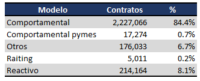
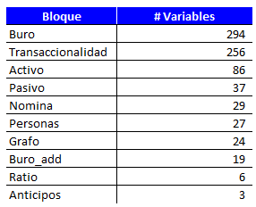
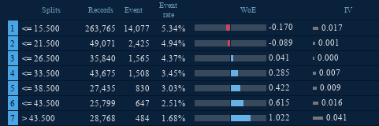
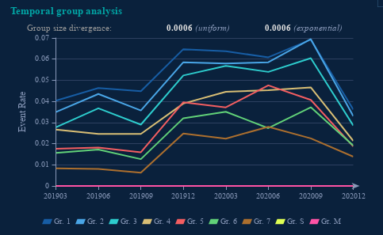
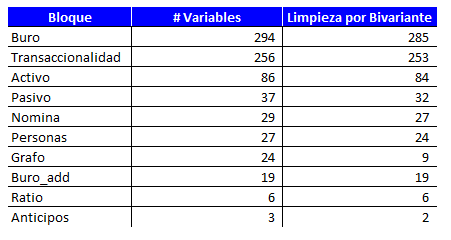

# Predicción del riesgo crediticio con impacto sostenible

**ABSTRACT**

This work focuses on addressing deficiencies in the risk prediction model for natural customers of ALFA Colombia. Currently, this model classifies approximately 53% of customers as high probability of default, despite the real default rate in risk entities being only 5%. This directly affects two strategic objectives of ALFA Colombia: growing in customers and efficiently applying data and technology.

The general objective of the project is to develop a new scoring model for the segment of customers who domicile their payroll and pension in the bank, in order to replace the existing model and provide support in credit pre-approval, risk monitoring, and provision calculation.

To achieve this objective, the organization's database of variables and customer transactional information will be utilized. Additionally, the inclusion of social network analysis using customer transactions will be explored to assess how they impact payment behavior and enhance the predictive capacity of the model. Other estimation methodologies that can provide more accurate predictions will also be tested, evaluated through the Gini index.

Finally, the energy efficiency of each proposed model will be analyzed to align it with the company's sustainable vision. A cost-benefit analysis will be conducted to justify the sustainability of the proposal.

In summary, this project aims to improve the risk prediction model of ALFA Colombia by developing a new scoring model, incorporating social network analysis, and evaluating other estimation methodologies. Additionally, the energy efficiency of each proposed model will be considered.

**RESUMEN**

Este trabajo se centra en abordar las deficiencias en el modelo de predicción de riesgo para clientes naturales de ALFA Colombia. Actualmente, este modelo clasifica aproximadamente al 53% de los clientes como alta probabilidad de impago, a pesar de que la tasa de mora en entidades de riesgo real es solo del 5%. Esto afecta directamente a dos objetivos estratégicos de ALFA Colombia: crecer en clientes y aplicar eficientemente los datos y la tecnología.

El objetivo general del proyecto es desarrollar un nuevo modelo de scoring para el segmento de clientes que domicilian nómina y pensión en el banco, con el fin de reemplazar el modelo existente y brindar soporte en la preconcesión de créditos, seguimiento del riesgo y cálculo de provisiones.

Para lograr este objetivo, se utilizará la base de datos de variables de la organización y la información de transaccionalidad de los clientes. Además, se explorará la inclusión del análisis de redes sociales utilizando las transacciones de los clientes para evaluar cómo afectan el comportamiento de pago y mejoran la capacidad predictiva del modelo. También se probarán otras metodologías de estimación que puedan proporcionar predicciones más precisas, evaluadas a través del índice Gini.

Finalmente, se analizará la eficiencia energética de cada modelo propuesto para alinearlo con la visión sostenible de la compañía. Se realizará un análisis de costo-beneficio para justificar la sostenibilidad de la propuesta.

En resumen, este proyecto busca mejorar el modelo de predicción de riesgo de ALFA Colombia mediante el desarrollo de un nuevo modelo de scoring, la inclusión del análisis de redes sociales y la evaluación de otras metodologías de estimación. Además, se considerará la eficiencia energética de cada modelo propuesto.

\*
# Introducción
ALFA Colombia es una entidad bancaria con presencia en más de 122 municipios a lo largo del territorio nacional, que se rige con base en seis prioridades estratégicas buscando la transformación del Grupo y el logro de su propósito: ‘Poner al alcance de todos las oportunidades de la nueva era’. (ALFA, 2022)

1\.	Mejorar la salud financiera de nuestros clientes

2\.	Ayudar a nuestros clientes en la transición hacia un futuro sostenible

3\.	Crecer en clientes

4\.	Buscar la excelencia operativa

5\.	El mejor equipo y el más comprometido

6\.	Datos y tecnología

Sin embargo, con el objetivo de cumplir estos pilares estratégicos en Colombia, se han detectado altas deficiencias en el modelo de predicción de riesgo para clientes naturales, lo cual está provocando que aproximadamente el 53% de los clientes sean clasificados con alta probabilidad de impago, mientras que la tasa de mora en entidades de riesgo real es solo de aproximadamente el 5% (Experian, 2022). Esto afecta directamente dos de los objetivos discutidos anteriormente: el primero es el crecimiento en clientes, ya que hay muchos clientes potenciales que no son bien calificados por el modelo, y el segundo es la adecuada aplicación de datos y tecnología, que está ausente en el modelo actual.
# 1. Descripción general
## 1.1 Oportunidad y problemática
Con el fin de dar solución a la problemática la idea del proyecto es utilizar la base de datos de variables  de la organización y la información de transaccionalidad  de los clientes para construir un modelo de predicción de incumplimiento. El modelo se utilizará con dos propósitos: primero, para ofrecer nuevos productos a los clientes actuales; segundo, para estimar la probabilidad de incumplimiento en el cálculo de la provisión para los clientes ya vinculados.

Sin embargo, dado que la entidad ya ha desarrollado un modelo basado en regresión logística, y la información utilizada para su construcción es la misma que estará disponible para la estimación del nuevo modelo, se explorará la inclusión del análisis de redes sociales (SNA) utilizando las transacciones de los clientes. El objetivo es evaluar cómo la centralidad de un nodo, la fuerza de sus relaciones y otras métricas del análisis afectan el comportamiento de pago y mejoran la capacidad predictiva del modelo (Óskarsdóttir & Bravo, 2021). Además, se planteará la prueba de otras metodologías de estimación que puedan proporcionar predicciones más precisas, las cuales serán evaluadas a través del índice Gini del modelo.

Finalmente, con el fin de abordar otro de los pilares estratégicos de la compañía y darle una perspectiva más sostenible a la solución planteada, se analizará la eficiencia energética de cada modelo para que la propuesta no solo genere mejores indicadores de predicción, sino que también se alinee con la visión sostenible de la compañía.
## 1.2 Objetivo general
Desarrollar un modelo de scoring para el segmento de clientes que domicilian nómina y pensión en el banco (vinculado), que permita reemplazar al vigente y brinde soporte tanto para la preconcesión de créditos como para el seguimiento del riesgo y el cálculo de parámetros para el consumo de provisiones en función de la probabilidad de mora.
## 1.3 Objetivos específicos
\- Evaluar la situación actual del banco y determinar la problemática que atacara el proyecto.

\- Realizar análisis de redes utilizando la información de transacciones.

\- Desarrollar y evaluar diversos modelos de predicción del comportamiento de pago del cliente.

\- Analizar la eficiencia energética de cada modelo propuesto.
# 2. Marco teórico 
El sector financiero en Colombia se caracteriza por tener más de $1.600 billones en activos y 415 entidades (El Tiempo, 2017), las cuales son organizaciones o instituciones, tanto públicas como privadas. A través de ellas se captan, administran, regulan y dirigen los recursos financieros que se negocian entre los diversos agentes económicos, ya sean personas, empresas, el Estado y/o el sector público. Estas entidades pueden clasificarse como entidades de crédito, sociedades de servicios financieros y otros establecimientos que agrupan diversas líneas de negocio, como se aprecia a continuación (Escuela Nacional Sindical, 2015).

**Ilustración 1:** Tipos de establecimientos financieros tomado de **(Asobancaria, 2021)** 

Para el desarrollo de este proyecto, el estudio se centrará en comprender los establecimientos de crédito, que tienen como función la captación de recursos del público en moneda legal a través de depósitos a la vista o a término. Estos recursos se destinan para su posterior colocación mediante préstamos, descuentos, anticipos u otras operaciones relacionadas con el crédito (Asobancaria, 2021), enfocándonos en el análisis de entidades bancarias. Estas son empresas financieras encargadas de captar recursos en forma de depósitos y otorgar préstamos, además de ofrecer una variedad de servicios financieros a través de sus diversas filiales.

Dentro de este contexto, las entidades bancarias operan con base en portafolios de productos compuestos principalmente por cuentas de ahorros, cuentas corrientes, créditos y tarjetas de crédito. Según el reporte de tipificación de Asobancaria para el segundo trimestre del año 2021, en Colombia, el 89,5% de la población adulta, conformada por personas mayores de edad, cuenta con al menos un producto financiero.

Asimismo, el sector financiero colombiano está dominado por unos pocos grupos financieros. Estos, a través de sus conglomerados de empresas, ofrecen un amplio portafolio de servicios que abarcan desde servicios bancarios, seguros y administración de valores, hasta la gestión de fondos de inversión, pensiones y cesantías, entre otros. Dos de estos grupos lideran el mercado con una participación de aproximadamente el 40% en las diferentes líneas de crédito.

 

**Ilustración 2:** Participación en el mercado de los bancos en Colombia. Tomado de **(Asobancaria, 2021)**
## 2.1 Scoring Bancario
El puntaje de crédito, también conocido como score, es una calificación que determina la probabilidad de que una persona cumpla con sus obligaciones financieras. Esta evaluación se basa en su historial crediticio, el uso y saldo de sus créditos, y otras variables sociodemográficas. En Colombia, empresas como DataCredito, Experian o TransUnion ofrecen canales de consulta para obtener este puntaje, que tiene un rango de 150 a 950 puntos. Cuanto más alto sea el puntaje, mayores serán las posibilidades de obtener un crédito, ya que representa un menor riesgo para las entidades financieras (El Tiempo, 2017).

Este concepto ha evolucionado para convertirse en una herramienta de apoyo a las actividades del analista de crédito. Los puntajes se utilizan para determinar factores de riesgo que se someterán a evaluación, y con base en la información recopilada, se realiza un análisis para aprobar o denegar una solicitud. Así, el Scoring se define como la implementación de sistemas de evaluación de riesgo financiero basados en técnicas de inteligencia artificial o "big data" (Ospina Díaz, 2017). Esta herramienta lleva los análisis de riesgo más allá de los reportes en centrales de riesgo hasta incluir información de las redes sociales.

En entidades bancarias, el Scoring se utiliza ampliamente en el crédito al consumo dirigido a particulares, tarjetas de crédito e hipotecas de vivienda, como señala Oriol Amat. Según datos de Fair Isaac Company, más del 75% de las entidades de crédito lo utilizan para la concesión de hipotecas y más del 90% lo emplean para tarjetas de crédito. Empresas como Equifax, Experian, TransUnion y Axesor suministran informes sobre clientes basados en scorings.

El Scoring se realiza a través del análisis discriminante, que consta de dos etapas:

**Primera etapa (Análisis factorial discriminante):** El objetivo de esta etapa es identificar las variables que se utilizarán en el sistema de puntuación. Para ello, se necesita un conjunto de prestatarios que integran la muestra a utilizar y se definirán los comportamientos de los que se quieren formular predicciones (pago puntual de los créditos o impago de los créditos). Así como, es estado final de los clientes cumplimiento o incumplimiento (Oriol, 2014)

También se encuentra que las características que discriminan más suelen ser de tipo personal (edad, número de hijos…), socioeconómicas (situación laboral, tipo de contrato laboral, años de antigüedad en la empresa, barrio de residencia…) y financieras (ingresos, vivienda, patrimonio, titularidad de otros préstamos, historial de pagos con la entidad, incidencias de morosidad…). Hay informaciones de tipo personal que en determinados países no se pueden utilizar para confeccionar los Scoring, como la información sobre sexo, estado civil o raza, por ejemplo, ya que se considera que pueden ser discriminatorias.

**Segunda etapa (Diseño del sistema de puntuación):** Se emplean técnicas estadísticas como la regresión o las redes neuronales. La puntuación se crea para clasificar a los individuos en diferentes grupos según la probabilidad de pago de los préstamos. La asignación de puntos se realiza tras un análisis detallado de operaciones similares para evaluar las características del riesgo. (Oriol, 2014).

El total de puntos que se asignan al cliente informan de la probabilidad de que el préstamo tenga problemas, es decir, que no se retorne.  De esta manera, las entidades financieras establecen una clasificación que suele desglosarse en muy bueno o bueno, regular o malo. Si un cliente se asigna a la categoría "malo", es probable que se desestime su solicitud; mientras que si se asigna a la categoría "regular", se pueden requerir más garantías y se podrían ajustar las condiciones del préstamo.
## 2.2 ALFA Colombia
En ALFA Colombia, se disponen de herramientas de calificación que facilitan la identificación de la calidad crediticia de sus clientes mediante una valoración y su relación con las denominadas probabilidades de incumplimiento ("PD"). Para analizar la variación de estas probabilidades, se cuenta con herramientas de seguimiento y bases de datos históricas que recopilan la información necesaria. Esto permite la generación de modelos de calificación que se agrupan en sistemas de Scoring y Rating (ALFA, 2021)
### 2.2.1 Rating
El rating, a diferencia de los scorings (que califican operaciones), es una herramienta enfocada a la calificación de clientes: empresas, corporaciones, Pymes, administraciones públicas, etc.
### 2.2.2 Scoring
El scoring es un modelo de decisión que facilita la concesión y gestión de créditos minoristas, tales como consumo, hipotecas y tarjetas de crédito para particulares. En ALFA, existen dos tipos de scoring según la información utilizada y su propósito:

Scoring reactivo: Evalúa el riesgo de una operación solicitada por un individuo mediante variables relacionadas con el producto solicitado y datos socioeconómicos disponibles en el momento de la solicitud.

Scoring de comportamiento o proactivo: Asigna una puntuación a nivel de cliente utilizando variables que consideran el comportamiento general del individuo con la entidad y su historial de pago en productos contratados. Su propósito es hacer un seguimiento de la calidad crediticia del cliente, utilizado para preconceder nuevas operaciones y gestionar el riesgo continuo de la entidad.

Al analizar la participación de cada tipo de modelo en el cálculo de las Probabilidades de Incumplimiento (PD) de la cartera activa, se observa que el Scoring de Comportamiento o Proactivo tiene un peso del 84.4% sobre el total de la cartera en ALFA Colombia.

**Tabla 1** Distribución de la cartera en los diferentes modelos del banco.

Es por esto que se decide trabajar en un modelo de scoring de comportamiento, dada su importancia para el banco y la identificación de deficiencias significativas en este ámbito. Sin embargo, considerando que este segmento de clientes es amplio e incluye a todos los clientes particulares y personas naturales con negocio pertenecientes a la entidad, se opta por enfocarse específicamente en el segmento de clientes que domicilian nómina o pensión en el banco (ver Ilustración 3).

El segmento en cuestión adquiere una gran importancia para el banco por dos motivos fundamentales. En primer lugar, es el segmento que presenta la mayor exposición de capital, lo que implica que su desempeño financiero y los riesgos asociados tienen un impacto significativo en la salud general de la institución. En segundo lugar, este segmento se encuentra dentro de la estrategia a corto plazo del banco en términos de crecimiento. En consecuencia, se busca continuar expandiendo y fortaleciendo su presencia en dicho segmento, alineándose con los objetivos y directrices establecidos por la organización.
## 2.3 Modelo actual
El modelo actual de ALFA Scoring fue desarrollado por la consultora AIS en 2014, utilizando información histórica del comportamiento de los clientes en el banco entre los años 2010 y 2012. Este modelo fue implementado en producción en 2015 y se divide en tres segmentos: clientes con únicamente productos de pasivo (cuentas de ahorro, cuentas corrientes, fondos de inversión o CDTs), clientes con productos del activo que domicilian la nómina o pensión con el banco (vinculados), y clientes del activo que no domicilian nómina ni pensión con el banco (no vinculados).

El modelo actual está compuesto por tres regresiones logísticas independientes, y la ponderación por bloque informacional y su composición se puede observar en la ilustración 4.

**Ilustración 4:** Distribución y pesos del modelo actual
### 2.3.1 Desempeño del modelo actual
Actualmente, el modelo de score comportamental presenta el siguiente desempeño en términos de Gini para los últimos meses evaluados, según se muestra en la Tabla 2.

**Tabla 2** Desempeño de los modelos actuales de Scoring.

Además, como se mencionó, este modelo se utiliza para generar campañas de preaprobado. Para esto, la calificación del score se asigna a grupos de riesgo del 1 al 6 para los segmentos de activo y del 1 al 10 para el segmento pasivo, siendo los primeros grupos los de menor riesgo. En la Tabla 3, se puede observar cómo se califican los clientes en los diferentes grupos durante un período y quiénes serían los clientes ofertables de acuerdo a las políticas de riesgo definidas por el banco.

**Tabla 3** Grupo de riesgo de los modelos actuales de Scoring

Considerando lo expuesto, se observa que el 53% de los clientes están siendo categorizados con una alta probabilidad de incumplimiento, mientras que la tasa de morosidad en entidades financieras reales es aproximadamente del 5%  (Experian, 2022) . Esto tiene un impacto directo en dos de los objetivos mencionados previamente: en primer lugar, en el crecimiento de la base de clientes, ya que existen muchos clientes potenciales que no están siendo adecuadamente evaluados por el modelo; en segundo lugar, en la correcta aplicación de datos y tecnología, aspectos que se encuentran ausentes en el modelo actual.
# 3. Trabajos relacionados
La predicción de riesgo crediticio y la búsqueda de las mejores estrategias para cumplir con esta tarea han sido ampliamente estudiadas a lo largo de los años, debido a la importancia que tienen tanto para las entidades financieras como para el sostenimiento y buen funcionamiento del mercado bursátil en general. En este contexto, las instituciones financieras tradicionales suelen utilizar principalmente la regresión logística como metodología de desarrollo. Esta técnica utiliza una gran cantidad de datos históricos para describir el nivel de ingresos del usuario, la capacidad de pago, el estado crediticio y otros indicadores. Luego, se dividen estos indicadores en varios niveles, generando así una tarjeta de puntuación de riesgo (scorecard) (Jian, Haibin, Zhijun, & Lei, 2021).

Con el desarrollo de las finanzas por Internet, la aplicación de métodos de aprendizaje automático (Nedellec et al. 1994; Boz et al. 2018; Shukla y Nanda 2019), por ejemplo, Árbol de decisión (Kruppa et al. 2013), Red neuronal (Luo, Wu y Wu 2016), Montecarlo (Andrade y Sicsú 2008) y Extreme Gradient Boosting (XGBoost) (Liu, Huang y Xie 2019; Qiu 2019), en la predicción del riesgo de crédito financiero comienza a florecer. Estos métodos tienen sus propias ventajas y desventajas (Zhang et al. 2007; Tran, Duong y Ho 2016; Wang et al. 2017; Li Y. 2019b; Hindistán et al. 2019; Wang et al. 2019a). Sin embargo, la aplicación de análisis de redes sociales (SNA) o el impacto ecológico de las diferentes metodologías son temas que no se han desarrollo a profundidad en la literatura y que solo cuentan con algunos pocos estudios.
## 3.1 Análisis de redes sociales para la predicción de riesgo 
El análisis de redes sociales en el contexto de las instituciones financieras ha sido objeto de atención principalmente en lo que respecta a la evaluación del contagio del riesgo entre dichas instituciones. Esto se evidencia en trabajos como el desarrollado por Bhattacharya, Inekwe y Valenzuela en 2020 o el desarrollado por Bundi en 2016. No obstante, estos estudios no se han llevado a cabo a nivel minorista debido a la complejidad que puede generar la granularidad de las interacciones. Es importante destacar que solo en la última década se ha logrado adentrarse en detalle en esta granularidad.

Un ejemplo de esto es el trabajo desarrollado por Óskarsdóttir y Bravo en 2022 en el cual se aplica el análisis de redes sociales (SNA) para predecir la probabilidad de incumplimiento en clientes con préstamos agrícolas. Esto era particularmente relevante dada la sospecha de la existencia de una correlación entre las tasas de impago entre los prestatarios expuestos a riesgos estructurales similares. Los hallazgos del estudio corroboran que la inclusión de información de red centralizada en el modelo conduce a importantes ganancias predictivas. Además, las ganancias aumentan cuando se incorpora información más compleja, como las variables de PageRank de múltiples capas (Óskarsdóttir & Bravo, 2021).

En el contexto del problema que estamos abordando, que se refiere a las relaciones entre clientes individuales de préstamos minoristas, es de gran importancia comprender los conceptos de redes dirigidas y no dirigidas. En las redes no dirigidas, dos nodos están conectados o no lo están, y es imposible que uno esté conectado al segundo sin que el segundo esté conectado al primero (Rishehchi Fayyaz, R. Rasouli, & Amiri, 2021). Este concepto suele ser válido en el contexto social, como en relaciones de amistad o conocidos. Sin embargo, existen otros tipos de redes en las que un nodo puede estar conectado a un segundo nodo independientemente de si el segundo nodo está conectado al primero (Jackson, 2010), Debido a la naturaleza direccional de las transacciones monetarias, en el contexto de esta investigación se consideran grafos como redes dirigidas.
## 3.2 Eficiencia energética entre metodologías de predicción
La utilización de herramientas de predicción basadas en el aprendizaje automático, destinadas a lograr la precisión predictiva a través de propiedades básicas de entrenamiento conocidas, es una práctica omnipresente en la industria (Omar Y, Paul D, Sami, George, & Kamal, 2015).Sin embargo, muchos de estos modelos no paramétricos basados en aprendizaje automático requieren un alto costo computacional para encontrar los óptimos globales. La complejidad de estos modelos aumenta exponencialmente con el número de iteraciones en las tareas de aprendizaje que implican grandes conjuntos de datos. Esto, a su vez, conduce a un aumento significativo de la complejidad computacional (Dandres, Schmidt, Luccioni, & Lacoste, 2019). 

Esta expansión del aprendizaje automático (AI)  lleva de igual manera a que cada vez el consumo de recursos energéticos y la cantidad de emisiones de carbono aumenten de igual manera. En 2015 se estimaba que un 2% del total de emisiones eran generadas por la industria de tecnología y comunicaciones (Omar Y, Paul D, Sami, George, & Kamal, 2015). De igual manera estudios recientes también han evaluado el impacto climático de la AI, centrándose principalmente en el costo ambiental del entrenamiento de modelos a gran escala que están conectados a redes alimentadas por combustibles fósiles que al utilizar múltiples GPUs durante largos períodos de tiempo, implican un consumo de energía cada vez mayor (Dandres, Schmidt, Luccioni, & Lacoste, 2019). 

En cuanto a la búsqueda de hiperparámetros, se ha demostrado tanto de manera empírica como teórica que la búsqueda aleatoria de hiperparámetros es más eficiente que la búsqueda en cuadrícula para la optimización. Además, es importante considerar la ubicación geográfica del servidor, el tipo de unidad de procesamiento gráfico (GPU) utilizada y la duración del entrenamiento, ya que estos factores tienen un impacto directo en la cantidad aproximada de CO2 que se produce durante el proceso de entrenamiento del modelo (Eggleston, Buendia, Miwa, Ngara, & Tanabe, 2006). En este sentido, es alentador destacar que compañías como Amazon Web Services (AWS) toman medidas para que sus centros de datos ya funcionan con fuentes de energía renovable (Amazon Web Services, 2023).

Es por todo esto que, se vuelve relevante que durante el proceso de concepción y desarrollo de códigos destinados a la predicción, se analice detenidamente el posible impacto energético de las diversas soluciones propuestas (Abdulsalam, Lakomski, Qijun, Tongdan, & Zong, 2015). Por tanto, además de su objetivo principal, de desarrollar un nuevo modelo de Scoring para los clientes vinculados, se quiere calcular el impacto energético asociado a dichas metodologías. Asimismo, se busca analizar el impacto energético de las estrategias de búsqueda de hiperparámetros utilizadas durante el entrenamiento de los modelos de predicción.
# ` `4 Comprensión de los datos
## 4.1 Descripción de los datos
Para este proyecto, se emplearán dos fuentes de información principales. La primera consiste en una base de datos construida por el área de analytics, que incorpora aproximadamente 700 variables internas y externas a nivel de cliente. Estas variables se consideran predictivas de riesgo tanto desde una perspectiva estadística[^1] o por criterio experto. Además de las variables explicativas, la base también cuenta con las variables objetivo que son utilizadas en diferentes modelos del área. 

La segunda fuente de información es la base de datos transaccional, que registra los movimientos financieros de los clientes a nivel de transacción. En esta base, se encuentran registrados datos como la fecha, el monto, la identificación del origen y la identificación del destino de las transacciones realizadas.

Como se mencionó anteriormente, el área trabaja con diferentes targets según el enfoque del modelo. En este caso, y por decisión del área usuaria del modelo, se va a trabajar con un target de incumplimiento de 90 días con vista a 12 meses, lo cual se puede entender mediante la siguiente gráfica.

Debido a la decisión de trabajar exclusivamente en el segmento vinculado, que, como mencionamos anteriormente, es el segmento más grande en cuota y cantidad de clientes, se opta por trabajar con una muestra de los clientes en cada trimestre. Para ello, se lleva a cabo una muestra estratificada simple con respecto a la fecha y al incumplimiento del cliente. De esta manera, la cantidad de clientes y la proporción de incumplimiento del proyecto serían las siguientes:

**Tabla 4.** Selección de la muestra para generación del modelo
## 4.2 Estructura de los datos
### 4.2.1 Base variables explicativas
La primera base del proyecto es una muestra de 677.378 registros del segmento vinculado que se extrae consolidado de variables que maneja el banco, la información acá contenida se divide en bloques informacionales que dependen del origen de la misma y está dividida de la siguiente manera:

- **Endeudamiento:** Tabla informacional mensual que contiene el detalle de obligaciones crediticias en balance en el banco a cierre de mes, así como detalles de saldos y días de atraso.
- **Pasivo:** Información de tipo mensual asociada a los productos del pasivo del cliente, como cuentas corrientes, de ahorro, fondos de inversión y CDT.
- **Nómina / Pensión:** Información relacionada a las cuentas de nómina y pensión del cliente, así como los valores aportados los últimos tres meses.
- **Obligaciones Canceladas:** identifica todas las posibles obligaciones activas y canceladas que ha tenido un cliente de forma histórica, incluyendo la totalidad de productos (seguros, garantías, crédito, cuentas de ahorro, etc). Cuenta además con información de perfil como edad, estrato y sucursal asociada a sus productos.
- **Transaccionalidad:** Información que contiene el detalle de interacciones del cliente y permite identificar tanto información asociada a transferencias, como pagos, compras, consultas entre otros.
- **Bureau de crédito (Qualities):** Información de los créditos activos y cancelados del Sistema Financiero Colombiano, así como alguna información relacionada al Sector Real y Telecomunicaciones.
### 4.2.2 Base transaccional
Tabla con información histórica que detalla las interacciones del cliente a través de varios canales (web, móvil, oficina, etc.). En ella se puede identificar tanto el usuario originador de la transacción como el monto y el destinatario de la misma. La tabla está organizada a nivel de transacción por día e incluye las siguientes columnas

|**Campo**|**Descripción**|
| :- | :- |
|transaction\_payment\_method\_type|
Código interno de transaccionalidad para identificar la forma en que un cliente realiza un pago en la operación. Ejemplos incluyen:

Efectivo

Cheque

Otros
|
|transaction\_amount|
Cuantía reflejada en la transacción ejecutada derivada de una operación bancaria entre el cliente y la entidad. Puede expresarse en distintas divisas, como:

Divisa de Liquidación: Divisa sobre la que se ha formalizado el contrato del cliente

Divisa Origen: País o geografía distinta al país del contrato del cliente
|
|transaction\_subchannel\_id|Código interno de transaccionalidad que identifica el subcanal a través del cual se realiza una transacción.|
|transaction\_operation\_type|
Código interno de transaccionalidad que identifica la agrupación funcional de la tipología de operativa que es posible realizar y registrar. Ejemplos incluyen:

Consulta

Contratación

Operaciones automáticas

Operaciones internas de la entidad

Otros
|
|ori\_customer\_id|Código identificativo unívoco del cliente ordenante de una operación.|
|ben\_customer\_id|Código identificativo unívoco del cliente beneficiario de una operación.|
|payment\_method\_type|
Marca utilizada para identificar la forma en que un cliente realiza un pago a la entidad. Ejemplos incluyen:

Efectivo

Tarjeta

Otros
|
|transaction\_channel\_id|Código interno de transaccionalidad que identifica el canal a través del cual se realiza una transacción.|
|operation\_date|Fecha en la que se realiza la operativa bancaria a la que va ligada la operación o movimiento. Puede no coincidir con la fecha en que se hace efectiva (fecha valor). Ejemplo: En una transferencia, la fecha de ejecución corresponderá al momento en que se ordena, aunque se hará efectiva y es posible que llegue a la cuenta destino horas/días más tarde.|

**Tabla 5** Descripción de variables tabla transaccional** 
# 5.  Análisis de redes 
## 5.1 Preparación de data
Dado que nuestro proyecto se enfoca en analizar las relaciones monetarias entre clientes del banco, se llevan a cabo varios tratamientos antes de generar el grafo:

- Se excluyen clientes que no pertenecen a la muestra de desarrollo.
- Se realiza un filtro para incluir únicamente los clientes y transacciones de los años de desarrollo (2018,2019, 2020, 2021)  
- Se excluyen transacciones que no tienen carácter monetario, como consultas, alertas, etc.
- Se realiza una agregación de las transacciones a nivel mensual:

**Tabla 6** Campos de transacción luego de transformación.

Después de obtener la base tratada y agrupada a nivel mensual, se inicia la siguiente fase del análisis, que consiste en la construcción del grafo.
## 5.2 Construcción de grafo
La construcción del grafo se llevó a cabo en varias etapas para explorar diferentes temporalidades y considerar tanto el peso como la cantidad de transacciones entre clientes. Se generaron un total de 6 grafos para cada período de observación. A continuación, se describen los detalles de cada grafo.

Considerando lo mencionado anteriormente, se construyeron un total de 6 grafos de iteraciones para cada período de observación de la siguiente manera:** 

**Grafo 1**: iteraciones entre clientes en el último año donde el peso de las iteraciones sea el monto de las transacciones (si estamos en el periodo marzo del 2020 se toman las iteraciones desde abril del 2019 hasta marzo de 2020).

**Grafo** **2**: iteraciones entre clientes en el último año donde el peso de las iteraciones sea la cantidad de transacciones (si estamos en el periodo marzo del 2020 se toman las iteraciones desde abril del 2019 hasta marzo de 2020).

**Grafo 3**: iteraciones entre clientes en los últimos seis meses donde el peso de las iteraciones sea el monto de las transacciones (si estamos en el periodo marzo del 2020 se toman las iteraciones desde octubre del 2019 hasta marzo de 2020).

**Grafo 4**: iteraciones entre clientes en los últimos seis meses donde el peso de las iteraciones sea la cantidad de transacciones (si estamos en el periodo marzo del 2020 se toman las iteraciones desde octubre del 2019 hasta marzo de 2020).

**Grafo 5**: iteraciones entre clientes en los últimos tres meses donde el peso de las iteraciones sea el monto de las transacciones (si estamos en el periodo marzo del 2020 se toman las iteraciones desde enero del 2020 hasta marzo de 2020).

**Grafo 6:** iteraciones entre clientes en los últimos tres meses donde el peso de las iteraciones sea la cantidad de transacciones (si estamos en el periodo marzo del 2020 se toman las iteraciones desde enero del 2020 hasta marzo de 2020).

Podemos observar los grafos generados para el periodo de observación de junio del 2022 en cada una de las seis condiciones:

**Ilustración 6:** Grafos vistos a un año el de la derecha con peso por monto de transacción y el de la izquierda por cantidad

**Ilustración 7:** Grafos vistos a seis meses el de la derecha con peso por monto de transacción y el de la izquierda por cantidad

 

**Ilustración 8:** Grafos vistos a tres meses el de la derecha con peso por monto de transacción y el de la izquierda por cantidad

## 5.3 Selección de variables a incluir en modelo
En la teoría del análisis de redes sociales una de las principales aplicaciones es la identificación de los actores “más importantes” en la red y para esto existen diversas medidas que describen y evalúan los la ubicación de los actores dentro de la red. Para esto se evalúan distintas definiciones de importancia o prominencia, como el grado, la cercanía, la intermediación y el estatus de los actores. Estas definiciones generan índices que cuantifican la importancia de los actores individual y grupalmente en la red (Wasserman & Faust, 1994).

En el caso de este proyecto las medidas que se calcularon sobre los grafos generados son las siguientes:

- **PageRank**: Es un algoritmo de clasificación que se basa en la idea de que un nodo es importante si es enlazado por otros nodos importantes. El algoritmo asigna una puntuación de importancia a cada nodo, lo que permite identificar los nodos más relevantes dentro de la red. 
- **Centralidad por Grado (Degree Centrality):** La centralidad por grado se refiere a la cantidad de conexiones que tiene un nodo en la red. Cuantas más conexiones tenga un nodo, mayor será su centralidad por grado. 
- **Centralidad de Eigenvector (Eigenvector Centrality):** La centralidad de eigenvector evalúa la importancia de un nodo en función de la importancia de sus vecinos. Un nodo tiene una alta centralidad de eigenvector si está conectado a otros nodos importantes en la red. 
- **Grado:** El grado de un nodo en una red social se refiere al número de conexiones que tiene ese nodo con otros nodos. Un nodo con un alto grado tiene muchas conexiones, mientras que un nodo con un bajo grado tiene pocas conexiones.

Tomando esto en cuenta en total por medio del análisis de redes se obtienen un total de veinticuatro métricas que se incluirán en dataset de información por cada periodo de observación.
# 6.  Preparación de datos 
## 6.1 Selección de los datos
Una vez se termina la ejecución variables derivadas del grafo esta información se une a la base de variables explicativas, para al final tener un set de datos de 781 variables, distribuidas de la siguiente forma:

Tabla 7: Total de variables por categoría
## 6.3 Estructuración de los datos
La estructuración y limpieza de los datos se lleva a cabo en dos etapas distintas. En la primera fase, se realiza un análisis bivariante de los datos en relación con el objetivo deseado (target) con el propósito de observar el comportamiento de cada variable en función del objetivo y, en consecuencia, eliminar aquellas que aporten poca información predictiva. Además, en esta fase, las variables se transforman mediante la metodología de "Weight of Evidence" (woe) para mejorar su capacidad predictiva.

En la segunda fase, se examina la correlación entre las variables y, en particular, se identifican aquellas que presentan una alta correlación. Con el objetivo de evitar problemas de multicolinealidad, se procede a eliminar una de las variables altamente correlacionadas que tenga un menor valor de Information Value (IV).
### 6.3.1 Análisis Bivariante
La primera parte de este proceso es la trasformación de las variables a woe, esta metodología se utiliza para transformar una variable independiente continua en grupos o contenedores, basándose en la similitud de la distribución de la variable dependiente, es decir, el número de eventos y no eventos (Deepanshu, 2023).

El WOE ofrece varios beneficios para mejorar modelos predictivos:

- Permite tratar valores atípicos al agruparlos en clases específicas.
- Maneja los valores faltantes al asignarles valores distintos.
- Elimina la necesidad de crear variables ficticias para variables categóricas.
- Facilita la construcción de relaciones lineales con las probabilidades logarítmicas, algo más complejo con otros métodos de transformación.

De esta manera, las variables se agrupan en distintos grupos, que pueden variar desde 2 hasta 13, dependiendo del comportamiento específico de cada variable. A continuación, se presenta un ejemplo para ilustrar el proceso.

**Ilustración 9:** División de variables en tramos por metodología WoE

**Ilustración 10:** Comportamiento de la variable por tramos en el tiempo

En la primera ilustración, se presentan los tramos en los que se dividió cada variable, junto con su valor WOE y el IV (Valor de Información) correspondiente para cada tramo. Por otro lado, en la segunda imagen, se muestra el comportamiento de cada grupo a lo largo del tiempo.

Además, en el Anexo 2 se proporciona información detallada para cada variable, incluyendo la cantidad de tramos en que se dividió, su IV y el Gini individual de la variable en comparación con el target. En esta sección, presentaremos únicamente en los resultados de las variables con el valor de información más alto.

**Ilustración 11:** Resultados del análisis bivariante para variable 240 del bloque Nomina

**Ilustración 13:** Resultados del análisis bivariante para variable 12 del bloque Bureau

En esta parte del proceso se eliminan las variables que tengan un information value menor al 2% como por ejemplo la variable 10 del bloque bureau.

**Ilustración 14:** Resultados del análisis bivariante para variable 10 del bloque Bureau

Una vez realizado este proceso de depurado la cantidad de variables finales por segmento son:

**Tabla 8:** Limpieza de variables en análisis Bivariante
### 6.3.2 Análisis de correlaciones
En la fase de depuración de las bases de datos, se realiza una evaluación exhaustiva de la correlación entre las variables, tanto en relación a ellas mismas como en relación al objetivo (target) del modelo. Durante este proceso, se toma la decisión de eliminar aquellas variables que presenten una correlación superior al 60% con el objetivo o una correlación superior al 80% con otras variables en el conjunto. En esta etapa, hemos eliminado un total de 394 variables que cumplen con estos criterios de alta correlación, optimizando así la calidad del conjunto de datos.

Para obtener un análisis detallado de las correlaciones entre cada par de variables, se proporciona el Anexo 3, donde se presenta la información detallada sobre los valores de correlación entre las variables.
# 7. Modelado
## 7.1 Selección de técnicas de Modelado 
Los análisis predictivos desempeñan un papel esencial al permitir realizar conjeturas sobre eventos futuros. Estas conjeturas se fundamentan en el estudio de acontecimientos pasados, la evaluación de la situación actual y la proyección hacia dónde nos dirigimos. A través del análisis de tendencias, patrones y relaciones en datos, tanto estructurados como no estructurados, esta metodología proporciona una perspicacia valiosa que se puede utilizar para prever acontecimientos futuros y tomar medidas con el fin de lograr resultados específicos.

En el contexto de este estudio, el objetivo principal es anticipar la probabilidad de que un cliente experimente ciertos eventos en los próximos 12 meses. Para lograrlo, se han sometido a prueba diversas técnicas estadísticas que permiten inferir esta probabilidad. Estas técnicas se basan en la información recopilada y extraída durante el proceso de desarrollo.

En el diseño de este modelo, se han evaluado varias técnicas de análisis cuidadosamente seleccionadas, con un enfoque especial en su capacidad explicativa, una cualidad esencial para las entidades financieras. Entre las técnicas empleadas en esta fase se encuentran:

- Regresión Logística
- Random Forest
- XGBoost

A continuación, se presenta una breve descripción de la metodología utilizada, junto con sus matices y particularidades.
### 7.1.1 Random Forest:
Los Bosques Aleatorios, o Random Forest, constituyen una combinación de árboles de decisión, que son clasificadores débiles. Esta técnica representa una modificación del Bagging, donde se trabaja con una colección de árboles correlacionados y se promedian (Hastie, Friedman y Tibshirani, 2001). En este enfoque, cada árbol depende de los valores de un vector aleatorio de la muestra de manera independiente y con la misma distribución en todo el bosque. Se observa que la generalización del error para los bosques converge a un límite a medida que el número de árboles en el bosque aumenta.

El error de generalización de un bosque de árboles de clasificación está influenciado por la fuerza de los árboles individuales en el bosque y la correlación entre ellos. La utilización de una selección aleatoria de características para dividir cada nodo contribuye a tasas de error que se comparan favorablemente con el algoritmo AdaBoost (Freund y Schapire, 1996), pero muestra una mayor robustez frente al ruido, lo que lo convierte en un clasificador más fuerte.
### 7.1.2 XGBoost (Extreme Gradient Boosting)
XGBoost es un método de código abierto ampliamente utilizado en retos y proyectos de minería de datos, como las competiciones de machine learning en plataformas como Kaggle. Este algoritmo implementa el boosting, realizando 𝐾 iteraciones en las cuales se añade un nuevo árbol de decisión en cada una. El propósito de cada nuevo árbol es corregir los errores cometidos en las iteraciones anteriores, con el objetivo de minimizar el error acumulado por los árboles previos.

Los árboles en XGBoost siguen una estructura que, en cada nodo interno, bifurca una variable según la condición 𝑣𝑎𝑟𝑖𝑎𝑏𝑙𝑒 < 𝑢𝑚𝑏𝑟𝑎𝑙. Este proceso clasifica las variables de entrada de manera repetitiva hasta alcanzar el nodo hoja correspondiente. La selección de la variable y sus umbrales en cada nodo se realiza de manera que minimice la función objetivo. Una vez en el nodo hoja, se obtiene un valor para la variable en cuestión, y el resultado final es el promedio ponderado, según los pesos de cada árbol del ensamble (Ilustración 15).

**Ilustración 15:** Ejemplo sencillo de XGBoost. 
### 7.1.3 Regresión Logística
La regresión logística es una herramienta estadística utilizada para predecir situaciones en las que se tiene una variable dependiente que es dicotómica (por ejemplo, presente/ausente representados como 1/0) y un conjunto de variables predictoras, que pueden ser cuantitativas o categóricas (las últimas deben convertirse en variables "dummy").

Esta metodología tiene dos objetivos principales:

- Predecir la probabilidad de que ocurra un evento específico, como estar desempleado (1) o no (0), ser pobre (1) o no (0), o graduarse como sociólogo (1) o no (0).
- Determinar qué variables influyen más en el aumento o disminución de la probabilidad de que ocurra el evento en cuestión.

Para lograr esto, se basa en las características de los individuos que han experimentado o no el evento en cuestión. Por ejemplo, si estamos analizando el desempleo, la regresión logística considerará las características (edad, sexo, educación, posición en el hogar, origen migratorio, etc.) de las personas que están desempleadas (1) y las que no lo están (0). A partir de estas características, se calcula una probabilidad para cada individuo, independientemente de su estado actual. Por ejemplo, un joven no jefe de hogar con poca educación, sexo masculino y origen migrante podría tener una alta probabilidad de estar desempleado, aunque esté trabajando actualmente, debido a la tasa de desempleo en ese grupo.

Además, la regresión logística analiza el impacto de cada variable independiente en el aumento o disminución de la probabilidad del evento. Por ejemplo, la educación tiende a reducir la probabilidad de desempleo, mientras que el género masculino puede aumentarla. El modelo estima los coeficientes de estos efectos (Chitarroni, 2022).
## 7.2 Generación de un plan de prueba
Como enfoque metodológico, se propone la utilización de dos conjuntos de datos distintos para cada técnica de modelado abordada en el presente documento. Específicamente, un conjunto de datos incorporará las variables de análisis de redes, mientras que el otro conjunto las excluye por completo. A través de este enfoque bimodal, se busca una evaluación exhaustiva de los resultados obtenidos en función de la presencia o ausencia de estas variables derivadas del análisis de redes sociales en el proceso de modelado.

Cabe destacar que, en consonancia con las directrices normativas regidas por ALFA, la métrica principal para evaluar los modelos concebidos es el coeficiente Gini. Dicha elección se sustenta en su capacidad para medir la probabilidad de que dos elementos extraídos al azar de una población exhiban pertenencia a clases distintas. Esta característica lo posiciona como una herramienta especialmente apta para el abordaje de problemas de clasificación. De manera crucial, el coeficiente Gini considera tanto los verdaderos como los falsos positivos y negativos, brindando así una visión holística del rendimiento del modelo en cuestión.

La interpretación del rango de esta métrica, que oscila entre 1 (denotando una clasificación perfecta) y 0.5 (indicando una clasificación al azar), facilita de sobremanera la comparación entre diferentes modelos y, en última instancia, la toma de decisiones informadas. Es oportuno mencionar que su eficacia se extiende a contextos en los que se presenta un desequilibrio entre las clases, lo que otorga relevancia en diversas aplicaciones financieras. Además, su idoneidad se hace evidente al poder aplicarse en variados algoritmos de clasificación, abarcando desde árboles de decisión hasta bosques aleatorios y regresión logística, entre otros. 
## 7.3 Construcción del modelo
Como se hizo mención previamente, se llevan a cabo dos ejercicios independientes para cada técnica de modelado, lo que resulta en un total de seis ejercicios de modelado distintos. Cada uno de estos ejercicios, en función de la técnica de modelado empleada, sigue sus propios flujos de trabajo que se detallarán en lo que sigue. Es relevante destacar que, durante el proceso de calibración para identificar el mejor modelo en todas las situaciones, se estableció como criterio que la diferencia entre el índice Gini obtenido en el conjunto de entrenamiento y el índice Gini logrado en el conjunto de prueba no excediera el 5%. Esta consideración se adoptó con el propósito de evitar que los modelos resultaran en una situación de sobreestimación.
### 7.3.1 Regresión logística
A continuación se presenta el esquema general del proceso que se siguió para la obtención del mejor modelo utilizando regresión logística, para más detallas sobre el mismo por favor consultar los anexos 5 y 6.

**Ilustración 16:** Flujo de proceso regresión logística
### 7.3.2 Random Forest
A continuación, se presenta el esquema general del proceso seguido para obtener el mejor modelo utilizando Random Forest. Es importante destacar que, atendiendo a la solicitud de ALFA con respecto a los modelos de aprendizaje automático (Random Forest y Xgboost), si bien las metodologías permiten obtener resultados en conjuntos de datos con un elevado número de variables, las limitaciones de ingeniería de los aplicativos utilizados para la interacción directa con el cliente requieren que los modelos se restrinjan a un máximo de 40 variables. Conscientes de esta restricción, se llevó a cabo un proceso de búsqueda recursiva de las mejores variables, considerando las más relevantes identificadas durante la ejecución con el conjunto de datos completo. Para obtener información detallada sobre el proceso, se recomienda consultar los anexos 7 y 8.

**Ilustración 17:** Flujo de proceso de Random Forest
### 7.3.3 Xgboost
A continuación se presenta el esquema general del proceso que se siguió para la obtención del mejor modelo utilizando Xgboost en los cuales también se aplicó la restricción de variables, para más detallas sobre el mismo por favor consultar los anexos 9 y 10.

**Ilustración 18:** Flujo de proceso Xgboost
## 7.4 Evaluación del modelo
Después de llevar a cabo la ejecución y obtener los resultados más destacados para cada metodología, los resultados finales, los parámetros que hemos obtenido y la distribución de los tipos de variables en cada ejecución se presentan a continuación:

**Tabla 9:** Resultados de ejecución de modelos

La importancia de cada variable en los modelos, junto con los resultados consolidados de las ejecuciones, se detalla en el anexo 11.
## 7.5 Evaluación de los resultados
La metodología que claramente genera mejores resultados en cuanto a predicción es XGBoost, por lo tanto, consideraremos únicamente estos dos modelos para evaluar su desempeño en diversas características.
### 7.5.1 Poder de predicción del modelo
El poder discriminante del modelo se ha medido con el Coeficiente de GINI. Este coeficiente mide el grado de concentración de un atributo en una población. En este caso estamos midiendo el grado de concentración del scoring de los clientes malos en la cartera. Si este coeficiente toma valor cero, entonces el scoring de los clientes malos se distribuye uniformemente y no es posible detectar diferencias con el scoring de los clientes buenos.

Ante esta situación, el scoring no distinguiría entre buenos y malos. Gráficamente, el coeficiente de GINI es el cociente entre 2 áreas:

**Ilustración 19:** Gini

Adicionalmente se ha calculado el estadístico de Kolmogorov-Smirnov (KS). Este estadístico se define como la distancia máxima entre la función de distribución empírica de las clasificaciones de los registros morosos y la función de distribución empírica de los registros no morosos. El rango en el que se mueve este estadístico es de 0 a 1. Dado que se desea que el modelo sea lo más discriminante posible, contra más cercano sea este valor a 1, el modelo será más discriminante.

| |***Gini***|***KS*** ||||
| :- | :-: | :-: | :-: | :- | :- |
|Metodología|Training|Test|Training|Test|Nº variables|
|XGB – No Grafo|68,64%|64,92%|52,88%|49,52%|25|
|XGB – Grafo|70,10%|66,84%|54,53%|51,57%|30|

**Tabla 10:** Resultados de modelos XgBoost

Adicionalmente, Podemos ver el comportamiento temporal del Gini en cada periodo temporal analizado donde vemos que los modelos son estables.

Tabla 11: Comportamiento temporal del Gini con grafo

Tabla 12: Comportamiento temporal del Gini sin grafo
### 7.5.2 Resultados de eficiencia del modelo
Para hacer una correcta interpretación del modelo y tener un conocimiento exhaustivo, es importante ver la distribución de la morosidad por intervalo de probabilidad de default o de puntuación. Por ello, se ha generado primero una tabla de eficiencia con la base de datos del entrenamiento y luego usando los intervalos ya obtenidos se ha creado otra tabla de eficiencia para la base de prueba. El objetivo de este análisis es mostrar que el ratio entre malos y buenos es monótono. Los resultados se ven en el anexo 12.
### 7.5.3 Estabilidad del modelo
Al estimar un modelo, se desea maximizar la métrica de discriminación (GINI). Sin embargo, también es importante obtener un modelo que sea estable. Por eso se han realizado los siguientes análisis:

- El cambio de la distribución de la puntuación a lo largo del tiempo: No se espera observar cambios drásticos de T a T+1. Por ello, el modelo elegido no debería mostrar diferencias significativas en la distribución de la puntuación a lo largo del tiempo. 
- El cambio de la distribución de las variables que forman parte del modelo a lo largo del tiempo. La estabilidad de la puntuación final depende de la estabilidad de las variables de entrada. Por eso, además de la distribución de la puntuación, también se han analizado las variables de input.

**Ilustración 20** Distribución del score en cada periodo temporal en modelo con grafo

**Ilustración 21** Distribución del score en cada periodo temporal en modelo con grafo

Los resultados complementarios se presentan en el anexo 13.
### 7.5.4 Resultados de desempeño versus modelo actual 
Para evaluar el impacto potencial de la implementación del nuevo modelo, se procedió a realizar un análisis retrospectivo utilizando los mismos clientes de la muestra de desarrollo. Se accedió al historial de resultados del modelo actual y se calculó el índice Gini, empleando el mismo target utilizado durante el desarrollo del presente proyecto, que se define como aquellos clientes que presentan mora mayor a 90 días con una perspectiva de 12 meses.

Los resultados de esta comparación se detallan en las Ilustraciones 22 y 23, tanto para el modelo que incorpora variables de grafo como para aquel en el que estas variables no están presentes.

**Ilustración 22.** Desempeño modelo actual versus XGB sin grafo

**Ilustración 23** Desempeño modelo actual versus XGB sin grafo 

Los resultados derivados de la comparación entre los nuevos modelos y el modelo actual revelan avances significativos, destacándose mejoras sustanciales en diversas cohortes. Por ejemplo, en la cohorte de marzo de 2019, el Índice Gini del nuevo modelo exhibe un notable 74.3%, superando significativamente el 41.9% del modelo actual. Esta tendencia positiva se mantiene constante en otras cohortes, evidenciando un aumento considerable en la capacidad de discriminar el riesgo crediticio. Es especialmente notable el desempeño de los nuevos modelos en cohortes más recientes, como la de diciembre de 2020, donde logra un Índice Gini del 66.6% y 65.7%, en comparación con el 36.9% del modelo actual.
# ` `8. Análisis de eficiencia energética 
En el proceso de evaluación del consumo energético, es crucial destacar que el proyecto se llevó a cabo en el entorno de PySpark debido a su alineación con la infraestructura del servidor de riesgos en la empresa Alfa. La elección de trabajar en PySpark también estuvo condicionada por restricciones de seguridad que impedían la extracción de información del proyecto para su ejecución y medición de consumo en un entorno local. Estas restricciones, comunes en entornos empresariales, subrayaron la necesidad de realizar todas las etapas del proyecto directamente en el entorno proporcionado por la empresa.

Es importante señalar que el entorno de trabajo en PySpark está diseñado específicamente para la ejecución de tareas distribuidas y procesamiento masivo de datos. Aunque este enfoque ofrece grandes ventajas en términos de escalabilidad y eficiencia, presenta desafíos particulares en la obtención detallada de información sobre el consumo de energía. A pesar de que la medición directa del consumo de energía habría sido la opción preferida, la limitada disponibilidad de información detallada desde el entorno de PySpark motivó la elección de métricas alternativas, como el tiempo y la memoria, como indicadores pragmáticos para evaluar el rendimiento. Estas métricas proporcionan una visión esencial del rendimiento computacional y son factores clave para evaluar la eficiencia de los modelos en un entorno distribuido.

Debido a lo anterior, no es posible medir directamente la energía. No obstante, sí se pueden proporcionar detalles técnicos sobre el entorno en el que trabajamos. Dependiendo de la talla asignada a cada usuario de riesgo, en nuestro **caso, trabajamos en la talla Py** durante el desarrollo.

**Ilustración 24:** Información técnica de capacidad del servidor
## 8.1 Análisis de eficiencia en modelado
Con el fin de evaluar el impacto del uso de diferentes herramientas en el consumo energético durante el entrenamiento del modelo, primero realizamos una evaluación del tiempo y la memoria utilizados en estos procesos. Además, este mismo proceso se llevó a cabo para el cálculo de las variables de grafo, dado que es un proceso iterativo que consume significativamente más recursos que la construcción de otros tipos de variables que también evaluamos.

### 8.1.1 Gasto en tiempo
Para llevar a cabo la medición del tiempo de ejecución, se registra la hora al iniciar la ejecución del código y posteriormente al finalizar la misma. De esta manera, calculamos la duración en horas de la ejecución y luego convertimos este valor a minutos para obtener una lectura más precisa y comprensible.

|**Modelo**|**Horas**|**Segundos**|
| :-: | :-: | :-: |
|Variables de Grafo|6:04:23|364\.38|
|Regresión con grafo|0:47:56|47\.93|
|Regresión sin grafo|0:38:06|38\.10|
|Xgboost con grafo|3:16:42|196\.70|
|Xgboost sin grafo|2:51:15|171\.25|
|Ramdon con grafo|1:47:50|118\.23|
|Ramdon sin grafo|1:58:14|107\.83|

**Tabla 13:** Tiempo consumido en construcción de grafo y entrenamiento de modelos

### 8.1.2 Gasto en Memoria
La métrica de memoria que consideramos en este caso es la memoria máxima utilizada durante la ejecución del código, ya sea durante el entrenamiento o la generación de variables, según corresponda al caso particular. Este dato se representa en megabytes (MB) de memoria consumida.

|**Modelo**|**Memoria (MB)**|
| :-: | :-: |
|Variables de Grafo|1728\.57|
|Regresión con grafo|5938\.77|
|Regresión sin  grafo|5898\.70|
|Xgboost con grafo|2959\.97|
|Xgboost sin grafo|2740\.59|
|Ramdon con grafo|2562\.27|
|Ramdon sin grafo|2517\.46|

**Tabla 14:** Memoria consumida en construcción de grafo y entrenamiento de modelos
## 8.2 Análisis de eficiencia en producción
Debido a las restricciones iniciales de recursos en el entorno de PySpark proporcionado por ALFA, nuestro proyecto se vio obligado a trabajar con una muestra representativa de clientes. Para abordar el análisis de la eficiencia energética en producción, llevamos a cabo mediciones de tiempos de ejecución en los seis modelos previamente desarrollados. Estas mediciones abarcaron diferentes cantidades de clientes con el objetivo central de establecer relaciones entre la cantidad de registros, el tiempo de ejecución y el consumo de memoria.

En cada uno de los seis modelos, aplicamos distintas aproximaciones matemáticas, que incluyeron modelos lineales, polinómicos de segundo grado, exponenciales y logarítmicos. Evaluamos la idoneidad de estas aproximaciones mediante el coeficiente de determinación (R²) para seleccionar la función que mejor se adaptara a los datos. Esto nos permitió estimar de manera precisa la utilización de memoria y el tiempo real necesario para la ejecución de estos modelos en un entorno de producción.
### 8.2.1 Gasto en tiempo y memoria
Como se mencionó previamente, para obtener las funciones que relacionan el tiempo y la memoria con la cantidad de registros, segmentamos la muestra en diez partes, aumentando su tamaño en un 10% en cada iteración. Luego, cargamos el mejor modelo resultante de cada uno de los seis entrenamientos realizados en el proyecto y lo aplicamos a la muestra parcial para determinar el tiempo requerido para realizar predicciones sobre el nivel de incumplimiento. Cuyo resultado presentamos a continuación:

**Tabla 15:** Consumo de tiempo y memoria en la ejecución de modelos con diferentes cantidades de clientes
### 8.2.2 Estimación de curvas
Una vez se completó el cálculo de los tiempos y la memoria consumida en cada muestra, se procedió a estimar las curvas que mejor representan el comportamiento del tiempo y la memoria en relación con el tamaño de la muestra. Este proceso se llevó a cabo utilizando Microsoft Excel, donde se generaron gráficos de dispersión para cada modelo y se evaluó cuál de las curvas (logarítmica, exponencial, polinómica base dos o lineal) se ajustaba de manera óptima a los datos. A continuación, se presentan los resultados finales de las curvas seleccionadas y en el anexo 13 se detalla los datos y análisis realizados
#### 8\.2.2.1 Xgboost

#### 8\.2.2.2 Random Forest

#### 8\.2.2.3 Regresión Logística

#### 8\.2.2.4 Estimación tiempo y memoria población total
Como se detalla en el análisis previo, en todos los casos, la estimación polinómica demostró el mejor ajuste a los datos. Sin embargo, la diferencia en rendimiento con la regresión logística es mínima. Con el objetivo de prevenir un posible sobreajuste, se optó por utilizar la regresión logística para calcular el tiempo necesario para evaluar la probabilidad de incumplimiento de los clientes en la muestra completa. A continuación, se presentan los resultados obtenidos:

**Tabla 16:** Estimación de tiempos en producción con población total

Los resultados del tiempo total en segundo y la memoria en MB utilizada para la población completa se detallan en la columna "y" en azul claro. Nuevamente, se confirma que el modelo que consume menos recursos es el XGBoost.
## 8.3 Resultados
### 8.3.1 Resultados en Entrenamiento
En el proceso de medición de eficiencia energética durante el entrenamiento de modelos, se obtuvieron resultados significativos. Las mediciones se centraron en evaluar el tiempo y la memoria utilizados en estos procesos, incluyendo el análisis de las variables de grafo, que resultaron ser particularmente intensivas en recursos. En términos generales, los modelos de regresión, tanto con cómo sin variables de grafo, demostraron un mejor rendimiento en cuanto a tiempos de entrenamiento en comparación con Random Forest y XGBoost, pero tienen un mayor consumo de memoria ya que al trabajar en el algoritmo de regresión no se entrena en distribuido sino que se utiliza pandas lo que genera una mayor utilización de memoria.

Entre las técnicas evaluadas, XGBoost fue la que requirió más tiempo de entrenamiento, especialmente cuando se aplicaron variables de grafo. Por otro lado, las técnicas de Regresión Logística, tanto con cómo sin variables de grafo, destacaron por su eficiencia en términos de tiempo durante el proceso de entrenamiento. Sin embargo, al analizar los resultados predictivos en su conjunto, se observa una marcada diferencia en la capacidad predictiva entre la utilización de machine learning y su ausencia.

Es importante destacar que, en el caso de las variables de tipo grafo, su consumo en términos de recursos es aún mayor que el del entrenamiento de algunos modelos, y no están generando una ganancia predictoria significativa. Además, la generación de estas variables debería realizarse en cada ejecución del modelo, a diferencia del entrenamiento. Por lo tanto, no resulta sugerible su implementación.

No obstante, es relevante señalar que, aunque en esta ocasión las redes no proporcionaron información altamente predictiva, el aumento en el uso de los canales digitales en el futuro podría permitir la creación de redes con un mayor grado de relación, ya que se conocería el origen y el destino de los datos. Por lo tanto, es posible que en el futuro se vuelva a analizar la incorporación de este tipo de información en la predicción del riesgo, especialmente en segmentos más específicos y menos masivos, como las recuperaciones de cartera.
### 8.3.2 Resultados en Producción
En conclusión, el análisis de eficiencia en producción realizado en este proyecto ha arrojado resultados significativos que arrojan luz sobre la elección y optimización de modelos en un entorno de PySpark. Las limitaciones iniciales de recursos, que nos llevaron a trabajar con muestras de diferentes tamaños, proporcionaron información valiosa sobre la relación entre el tiempo de ejecución, la utilización de memoria y la cantidad de registros.

El modelo XGBoost (XGB) se destacó por su consistente eficiencia en términos de tiempo de ejecución en todas las muestras, manteniendo una utilización de memoria constante. Por otro lado, los modelos de Regresión Logística (RL) mostraron una previsibilidad en sus métricas, aunque se observaron variaciones inusuales en el uso de memoria en ciertas situaciones. Los modelos de Bosques Aleatorios (RF) ofrecieron tiempos de ejecución razonables, aunque consumieron más memoria en comparación con XGBoost.

Estos hallazgos respaldan la importancia de considerar tanto el tiempo de ejecución como la utilización de memoria al seleccionar y optimizar modelos para la implementación en producción. La elección del modelo adecuado dependerá de los recursos disponibles y las necesidades específicas del proyecto. En última instancia, esta investigación proporciona una base sólida para la toma de decisiones informadas en la producción de modelos en un entorno de análisis de datos.
### 8.3.3 Resultados de eficiencia versus modelo actuales
En este punto, realizar una comparación lineal de las mejoras entre el modelo actual y la propuesta del proyecto resulta desafiante, ya que no solo influye el cambio de metodología, sino que también implica un cambio tecnológico significativo dentro de la compañía. El modelo actual no se ejecuta desde un entorno de inteligencia, sino que es un proceso manual que se lleva a cabo desde SAS Enterprise Manager, donde se han identificado deficiencias y definiciones manuales de modelos generados.

Teniendo en cuenta este contexto, el proceso actual de generación del score en la cartera particular requiere aproximadamente 6 horas. Al validar los resultados de la proyección del modelo XGBoost, se estima que el tiempo necesario para calificar con esta propuesta sería de aproximadamente 3 minutos, considerando la población total. Este cambio drástico en el tiempo de ejecución resalta la eficiencia y la agilidad que aportaría la implementación de la nueva metodología y tecnología propuestas en el proyecto.
# 9. Conclusiones
En este estudio, se llevó a cabo la construcción de variables, el entrenamiento y la evaluación de modelos de predicción de incumplimiento de clientes del banco Alfa que domiciliaban nómina o pensión en el banco. Estos modelos fueron evaluados no solo en términos de eficiencia técnica, sino también en su consumo energético. Se emplearon técnicas como la Regresión Logística, Random Forest y XGBoost, seleccionadas por cumplir con las regulaciones de la compañía en cuanto a explicabilidad exigida por el ente regulador. Al final, XGBoost se destacó como el modelo más efectivo en predecir la probabilidad de incumplimiento de los clientes vinculados, gracias a su capacidad de aprendizaje y alto poder predictivo.

El estudio abarcó la evaluación de modelos tanto con cómo sin variables de análisis de redes, con el propósito de determinar su aporte significativo al modelo. Aunque se observó que estas variables podrían mejorar la capacidad predictiva, su exclusión no generaba una pérdida sustancial de eficiencia, especialmente considerando el aumento en el costo computacional al aplicarlas en un contexto de granularidad tan alta como las transacciones bancarias. No obstante, se recomienda considerar este tipo de análisis en otros tipos de clientes, como los empresariales, donde los conjuntos de datos son más pequeños y han demostrado ser exitosos en la literatura.

Una de las razones por las cuales el estudio de redes no parece aportar un valor significativo en la mejora del poder predictivo del modelo es que, al detallar las relaciones de los actores en la red, se observó que eran pocos los casos donde los actores se relacionaban con varios nodos; la mayoría no interactuaba con otros clientes, por lo cual no se encontraba esta sinergia que aporta valor en el Análisis de Redes Sociales (SNA, por sus siglas en inglés). Sin embargo, no se debe descartar su inclusión en el futuro, ya que estos datos están sujetos a un periodo temporal en el cual el banco no contaba con una app móvil que facilitara los movimientos de dinero entre personas. Este escenario cambió en marzo de 2023 con el lanzamiento de la nueva app móvil, y ya se observa un aumento en el uso de canales web en el banco. También es relevante destacar que, según estudios en la literatura de SNA, estas variables tienden a tener más poder en entornos empresariales, por lo que se recomienda realizar el análisis con modelos orientados a este tipo de clientes.

En términos de consumo de recursos, se obtuvieron valiosas conclusiones tanto en el entrenamiento como en la implementación. Se destacó que la Regresión Logística era menos costosa en tiempo en comparación con Random Forest y XGBoost, pero con un mayor uso de memoria debido a su entrenamiento no distribuido. Asimismo, se observó que las variables de grafo, aunque intensivas en recursos, no aportaron una ganancia significativa en la capacidad predictiva, lo que sugiere su no implementación. No obstante, se vislumbra la posibilidad de considerar su uso en el futuro, dada la tendencia al aumento en el uso de canales digitales. En resumen, XGBoost se posiciona como la mejor opción de implementación tanto por eficiencia energética como por poder predictivo, pero es importante recordar que estos resultados son válidos en contextos similares a los abordados en este estudio, donde se acotan la cantidad de variables finales del modelo, ya que en escenarios sin esta limitación, las técnicas de machine learning tienden a ser más costosas en recursos.
# 10. Recepción del negocio
Este trabajo también fue presentado a la organización durante su desarrollo, contando con el acompañamiento del manager de modelos de riesgos. Este colaborador proporcionó valioso feedback sobre las condiciones de negocio y los requisitos técnicos que el modelo en producción debía cumplir. Es importante destacar que el proceso formal de desarrollo del nuevo modelo de scoring comportamental en el banco ya se ha iniciado. Este desarrollo comenzó a principios de septiembre, y se espera que se entregue al comité en junio de 2024. La decisión de tomar como base los resultados de este modelo para iniciar el desarrollo refleja la confianza en su viabilidad y relevancia.

En relación con la implementación del nuevo modelo comportamental, se optará por utilizar XGBoost como herramienta de predicción. No se utilizará el mismo modelo que ya se generó por tres razones fundamentales. En primer lugar, se busca incorporar todos los segmentos de clientes dentro del modelo, no limitándose solo a los clientes vinculados. En segundo lugar, se cambiará la ventana temporal de evaluación, aprovechando la disponibilidad de la información completa de 2022. La generación de métricas se llevará a cabo entre 2020 y 2021, con observación en 2022. Como tercer motivo, se incorporarán otras fuentes de información desarrolladas por el área de client solution. Estas fuentes incluyen variables relacionadas con la huella digital de los clientes y variables de advice que indican las categorías de productos más adquiridas por los clientes del banco.
# 11. Trabajos futuros
En el horizonte de trabajos futuros, se vislumbran diversas oportunidades para mejorar y expandir la eficacia de los modelos desarrollados. Se sugiere explorar una colaboración activa con el área de ingeniería para llevar a cabo mediciones detalladas del consumo energético asociado a distintas técnicas de machine learning. Esta iniciativa permitirá obtener una comprensión más precisa del impacto ambiental de las operaciones de modelado, respaldando así decisiones basadas en criterios de sostenibilidad.

Además, se plantea la necesidad de actualizar los modelos existentes para abarcar otros segmentos de clientes, proporcionando una visión más completa del comportamiento crediticio en toda la base de clientes. Asimismo, se propone la optimización de los hiperparámetros del modelo XGBoost mediante herramientas de optimización automática como AutoGluon, con el objetivo de potenciar aún más su rendimiento.

En el ámbito de la mejora de los modelos, se destaca la importancia de explorar técnicas de descarte de variables, como Recursive Feature Importance (RFI) y Recursive Feature Elimination (RFE), para refinar el conjunto de variables predictoras y fortalecer la eficiencia y la capacidad predictiva del modelo.

La implementación exitosa del nuevo modelo en el entorno de producción se presenta como un paso crucial. Garantizar una transición suave y eficiente del modelo desarrollado al entorno operativo es esencial para aprovechar plenamente los beneficios del nuevo enfoque.

Para ampliar la comprensión del riesgo crediticio en diferentes contextos, se propone extender el análisis de redes a segmentos empresariales. Evaluando cómo las interacciones entre clientes impactan el riesgo crediticio en este contexto específico, se puede obtener una perspectiva más completa y detallada.

Finalmente, se sugiere realizar una evaluación exhaustiva del impacto ambiental de los modelos actuales, considerando factores como el consumo energético y otros recursos. Este análisis contribuirá a una mayor conciencia de la sostenibilidad de las operaciones de modelado en el contexto empresarial y proporcionará información valiosa para posibles ajustes futuros.
# Bibliografía
Abdulsalam, S., Lakomski, D., Qijun, G., Tongdan, J., & Zong, Z. (2015). Program Energy Efficiency: The Impact of Language, Compiler and Implementation Choices. *International Green Computing Conference*, 03-05.

ALFA. (2021). *Informe Individual Colombia 2021*. Obtenido de file:///C:/Users/c805821/Documents/Tesis/Informe-individual-mar22.pdf

ALFA. (2022). *Informacion Corporativa*. Obtenido de Carta del presidente: https://www.alfa.com/es/informacion-corporativa/#carta-presidente

Amazon Web Services. (5 de Mayo de 2023). *Aws & sustainability*. Obtenido de https://aws.amazon.com/es/industrial/sustainability/

Andrade, F., & Sicsú, A. (2008). A credit risk model for consumer loan portfolios. *Latin American Business*, 75-91.

Asobancaria. (2021). *Marco jurídico del sector financiero colombiano*. Obtenido de http://www.asobancaria.com/portal/page/portal/Asobancaria/publicaciones/juridico_legal/marco_juridico_del_sector_financiero_colombiano/estructura_del_sector_financiero/

Boz, Z., Gunnec, D., Birbil, S., & Öztürk, M. (2018). Reassessment and monitoring of loan. *Applied Artificial Intelligence*, 09-10.

Chitarroni, H. (2022). La regresión logística. *Instituto de Investigación en Ciencias Sociales*, 1-8.

Dandres, T., Schmidt, V., Luccioni, A., & Lacoste, A. (2019). Quantifying the Carbon Emissions of Machine Learning. *Computers and Society*. Obtenido de https://arxiv.org/pdf/1910.09700.pdf

Deepanshu, B. (28 de 07 de 2023). *Listen data*. Obtenido de WEIGHT OF EVIDENCE (WOE) AND INFORMATION VALUE (IV) EXPLAINED: https://www.listendata.com/2015/03/weight-of-evidence-woe-and-information.html

Eggleston, S., Buendia, L., Miwa, K., Ngara, T., & Tanabe, K. (2006). IPCC guidelines for national greenhouse gas inventories. *Institute for Global Environmental Strategies Hayama*.

El Tiempo. (2017). *Así lo califican los bancos como buena o mala paga*. Obtenido de https://www.eltiempo.com/economia/finanzas-personales/categoria-para-la-calificacion-de-los-usuarios-que-aspiran-a-un-credito-106818

Escuela Nacional Sindical. (2015). *Sector Financiero Y Bancario Colombiano Caracterís-ticas Económicas, Laborales y de Negociación Colectiva*. Obtenido de http://www.ens.org.co/wp-content/uploads/2016/12/DOCUMENTOS-DE-LA-ESCUELA_100-Sector-financiero-y-bancario-colombiano-Econ%C3%B3mico-laboral-y-de-negociaci%C3%B3n-colectiva-2015.pdf

Experian. (Septiembre de 2022). *RESUMEN EJECUTIVO ALFA 2022*. Obtenido de https://drive.google.com/file/d/11hQ9_YmxcDYvtVVpIqpVqg-r_pWcajAT/view?usp=sharing

Hindistan, Y., Aiyakogu, B., Rezaeinazhad, A., Korkmaz, H., & Dag, H. (2019). Alternative credit scoring and classification employing machine learning techniques on a big data. *International Conference on Computer Science and Engineering*, 1-4.

Jackson, M. (2010). Social and Economic Networks. *Princeton University Press*.

Jian, L., Haibin, L., Zhijun, Y., & Lei, H. (2021). A Credit Risk Model with Small Sample Data Based on G-XGBoost. *APPLIED ARTIFICIAL INTELLIGENCE, 35*(15), 1550-1566.

Kruppa, J., Schwarz, A., Arminger, G., & Ziegler, A. (2013). Consumer credit risk: Individual probability estimates using machine learning. *Expert Systems with Applications*, 25-31.

Li, Y. (2019). Credit risk prediction based on machine learning methods. *International Conference on Computer Science & Education*, 11-13.

Liu, Z., Huang, G., & Xie, L. (2019). Is risk management with big data effective? Comparison and analysis based on statistics score card and machine learning model. *Statistics & Information Forum*, 18-26.

Luo, C., Wu, D., & Wu, D. (2016). A deep learning approach for credit scoring using credit default swaps. *Engineering Applications of Artificial Intelligence*, 65.

Nedellec, C., Correira, J., Ferreira, J., & Costa, E. (1994). Machine learning goes to the bank. *Applied Artificial Intelligence*, 593-615.

Omar Y, A.-J., Paul D, Y., Sami, M., George, K., & Kamal, T. (2015). Efficient Machine Learning for Big Data: A Review. *Big Data Research*, 87-93.

Oriol, A. (2014). *Scoring y rating. Cómo se elaboran e interpretan*. Obtenido de http://www.supercontable.com/envios/articulos/BOLETIN_AVENIDA_02_2014_Articulo_2.htm

Óskarsdóttir, M., & Bravo, C. (Diciembre de 2021). Multilayer network analysis for improved credit risk prediction. *Omega, 105*, 102520. Obtenido de https://www.sciencedirect.com/science/article/abs/pii/S0305048321001298?via%3Dihub

Ospina Díaz, N. (2017). Scoring: un reto del mundo Fintech. *PORTAFOLIO*.

Qiu, W. (2019). Credit risk prediction in an imbalanced social lending environment based on XGBoost. *International Conference on Big Data and Information Analytics*, 50-56.

Rishehchi Fayyaz, M., R. Rasouli, M., & Amiri, B. (2021). A data-driven and network-aware approach for credit risk prediction in supply chain finance. *Industrial Management & Data y Systems*, 785-808.

Shukla, U., & Nanda, S. (2019). Designing of a risk assessment model for issuing credit card using parallel social spider algorithm. *Applied Artificial Intelligence*, 191-207.

Tran, K., Duong, T., & Ho, Q. (2016). A combination of genetic programming and deep learning. *Future Technologies Conference*, 45-49.

Wang, C., Xu, C., Yao, X., & Tao, D. (2019). Evolutionary generative adversarial networks. *IEEE Transactions on Evolutionary Computation.* .

Wang, H., Zhong, J., Zhang, F., & Zou, X. (2017). A new classification algorithm for the bank customer credit rating. *Ninth International Conference on Advanced Computational Intelligence*, 43-48.

Wasserman, S., & Faust, K. (1994). *Social Network Analysis.* United States: Cambridge University Press.

Zhang, D., Huang, H., Chen, Q., & Jiang, Y. (2007). A comparison study of credit scoring models. *Third International Conference of Natural Computation*.

